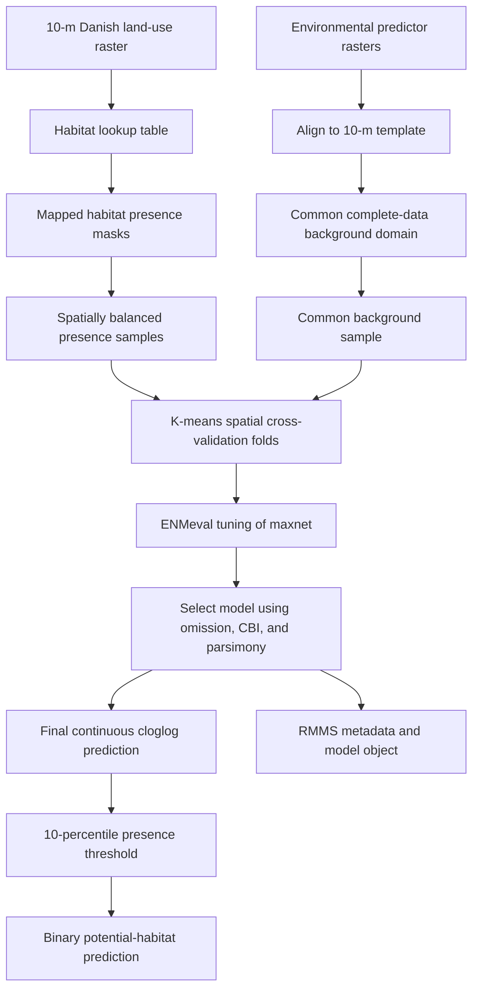

<!-- README.md is generated from README.Rmd. Edit README.Rmd, not README.md. -->

```{r setup, include=FALSE}
knitr::opts_chunk$set(
  collapse = TRUE,
  comment = "#>",
  warning = FALSE,
  message = FALSE,
  fig.path = "man/figures/README-",
  eval = FALSE
)
options(width = 100)
```

# HabitatPotentialDK

**Reproducible 10-m habitat-potential models for Danish terrestrial restoration pathways**

This repository develops continuous and thresholded maps of the environmental
potential for eight terrestrial habitat pathways across Denmark:

1. `ForestDryPoor`
2. `ForestDryRich`
3. `ForestWetPoor`
4. `ForestWetRich`
5. `OpenDryPoor`
6. `OpenDryRich`
7. `OpenWetPoor`
8. `OpenWetRich`

The workflow uses a classified 10 × 10 m land-use raster as the source of mapped habitat presences, a common sample of the available Danish landscape as background, `maxnet` models tuned with `ENMeval`, spatially separated k-means cross-validation folds generated with `blockCV`, and Range Model Metadata Standards (RMMS) metadata.

The primary outputs are:

- continuous relative habitat-suitability rasters on a cloglog scale;
- binary maps based on a documented omission-based threshold;
- cross-validation statistics and tuning tables;
- fitted model objects;
- fold maps and sampling diagnostics;
- RMMS metadata for every fitted model; and
- a complete record of package versions and modelling settings.

> **Interpretation:** these maps estimate environmental similarity or habitat
> potential relative to the mapped habitat used for training. They are not
> probabilities of habitat occurrence, guarantees of restoration success, or
> substitutes for field validation.

## Important modelling decision: four environmental templates or eight independent models?

The eight pathways combine three ecological axes:

- structure: open versus forest;
- moisture: dry versus wet; and
- fertility: nutrient-poor versus nutrient-rich.

The environmental predictors proposed here—soil texture, soil carbon, pH,
groundwater depth, climate, topography, and potential evapotranspiration—directly describe moisture, fertility, and broad climatic setting. They do **not** necessarily contain enough information to identify whether a location should be open or forested. Open versus forest structure is strongly affected by current and historical management, grazing, disturbance, succession, dispersal, and land-use history.

For that reason, the default design in this repository is:

1. fit **four abiotic habitat-potential models**:
   `DryPoor`, `DryRich`, `WetPoor`, and `WetRich`;
2. interpret each surface as a potential template for both an open and a forest restoration pathway; and
3. only fit eight independent models when structure-specific predictors are
   added and ecologically justified.

Potential structure-specific predictors could include forest continuity,
distance to existing native woodland, tree-cover history, grazing pressure,
disturbance regime, seed-source proximity, or explicit implementation
constraints. These should be kept conceptually separate from the abiotic
potential layer whenever possible.

Set `cfg$model_level <- "habitat"` below to fit all eight classes independently.
The default is `"abiotic_class"`.

## Statistical interpretation of presence and background

The mapped habitat cells are treated as **presences** of the habitat class.
Background points are a sample of environmental availability across the
accessible Danish terrestrial domain. Background is not labelled absence, and
background cells are not removed merely because they coincide with habitat
presence cells.

This is deliberate. Maxent and `maxnet` are presence-background methods. Their connection to Poisson point-process models provides a coherent interpretation without pretending that unobserved background locations are true absences [@phillips2006; @renner2013; @warton2010].

The cloglog output is reported as **relative habitat suitability**. It should not be described as occupancy probability unless additional assumptions and
calibration data justify that interpretation.

## Why ENMeval + maxnet + blockCV + RMMS?

- `maxnet` provides a fully R-based Maxent implementation without a Java
  dependency.
  
- `ENMeval` tunes feature classes and regularization, calculates omission rates and Continuous Boyce Index, supports custom folds, and records model metadata [@kass2021].

- `blockCV::cv_cluster()` creates k-means spatial folds from sample coordinates, reducing leakage caused by spatial autocorrelation [@valavi2019].

- `rangeModelMetadata` implements RMMS and allows each modelling decision to be exported in a structured format [@merow2019].

- `terra` supports file-backed processing and prediction for national 10-m
  rasters.

AUC and TSS are not used as primary model-selection statistics. AUC is retained only as a diagnostic because its absolute interpretation is problematic for presence-background models and depends on the selected background extent [@lobo2008]. TSS requires a binary presence-absence interpretation that is not appropriate when the comparison data are background.

## Workflow



## Repository structure

```text
HabitatPotentialDK/
├── README.Rmd
├── README.md
├── CITATION.cff
├── references.bib
├── renv.lock
├── .Rprofile
├── .gitignore
├── Data/
│   ├── basemap_reclass_SN_ModelClass.tif
│   ├── habitat_lookup.csv
│   ├── predictor_manifest.csv
│   └── Predictors/
│       ├── FineSand.tif
│       ├── CoarseSand.tif
│       ├── Clay.tif
│       ├── SoilCarbon.tif
│       ├── pH_0_5cm.tif
│       ├── GroundwaterSummerDepth.tif
│       ├── MeanTemp.tif
│       ├── TempSeasonality.tif
│       ├── MeanPrecip.tif
│       ├── PrecipSeasonality.tif
│       ├── Elevation.tif
│       ├── Slope.tif
│       ├── Aspect.tif
│       └── PET.tif
├── DerivedData/
│   ├── Predictors_10m/
│   ├── Samples/
│   └── Folds/
├── Models/
├── Metadata/
├── Outputs/
│   ├── Continuous/
│   ├── Binary/
│   ├── Diagnostics/
│   └── Tables/
└── man/
    └── figures/
```

Large input rasters should only be committed when their licences permit
redistribution. If a source raster cannot be redistributed, document its source,
version, checksum, units, native resolution, and acquisition date in
`Data/predictor_manifest.csv`, and provide an acquisition script or permanent
data citation.

## Reproducible software environment

Restore the exact environment on another computer with:

```{r restore-renv, eval=TRUE}
install.packages("renv")
renv::restore()
```

## Load packages

```{r packages, eval= TRUE}
required_packages <- c(
  "terra", "sf", "dplyr", "purrr", "readr", "tibble", "tidyr", "ggplot2",
  "here", "fs", "blockCV", "ENMeval", "maxnet",
  "rangeModelMetadata", "knitr", "sessioninfo"
)

missing_packages <- required_packages[
  !vapply(required_packages, requireNamespace, logical(1), quietly = TRUE)
]

if (length(missing_packages) > 0) {
  stop(
    "Install the missing packages before continuing: ",
    paste(missing_packages, collapse = ", ")
  )
}

library(terra)
library(sf)
library(dplyr)
library(purrr)
library(readr)
library(tibble)
library(tidyr)
library(ggplot2)
library(here)
library(fs)
library(blockCV)
library(ENMeval)
library(maxnet)
library(rangeModelMetadata)
```

## Configuration

All choices that affect the results are collected in one object. Avoid scattering
unrecorded constants throughout the script.

```{r configuration, eval=TRUE, cache=TRUE}
cfg <- list(
  project_title = "HabitatPotentialDK",
  version = "0.1.0",
  seed = 20260619L,

  # Input data
  habitat_raster = here("Data", "basemap_reclass_SN_ModelClass.tif"),
  habitat_lookup = here("Data", "habitat_lookup.csv"),
  predictor_manifest = here("Data", "predictor_manifest.csv"),

  # Output locations
  aligned_predictor_dir = here("DerivedData", "Predictors_10m"),
  sample_dir = here("DerivedData", "Samples"),
  fold_dir = here("DerivedData", "Folds"),
  model_dir = here("Models"),
  metadata_dir = here("Metadata"),
  continuous_dir = here("Outputs", "Continuous"),
  binary_dir = here("Outputs", "Binary"),
  diagnostic_dir = here("Outputs", "Diagnostics"),
  table_dir = here("Outputs", "Tables"),

  # Model target
  # "abiotic_class" = four models; "habitat" = eight independent models
  model_level = "abiotic_class",

  expected_habitats = c(
    "ForestDryPoor", "ForestDryRich", "ForestWetPoor", "ForestWetRich",
    "OpenDryPoor", "OpenDryRich", "OpenWetPoor", "OpenWetRich"
  ),

  expected_abiotic_classes = c(
    "DryPoor", "DryRich", "WetPoor", "WetRich"
  ),

  # Sampling
  # "spread" gives approximately regular spatial coverage over non-NA cells.
  presence_sampling_method = "spread",
  background_sampling_method = "random",
  max_presence_points = 20000L,
  n_background_points = 50000L,
  allow_presence_background_overlap = TRUE,

  # Spatial cross-validation
  n_folds = 5L,
  kmeans_nstart = 100L,
  minimum_presences_per_fold = 30L,

  # maxnet tuning
  feature_classes = c("L", "LQ", "LQH"),
  regularization_multipliers = seq(0.5, 4, by = 0.5),

  # Model selection
  maximum_mean_or10 = 0.15,
  cbi_tolerance_from_best = 0.02,

  # Binary map
  threshold_quantile = 0.10,

  # Computation
  parallel_tuning = TRUE,
  tuning_cores = max(1L, parallel::detectCores(logical = FALSE) - 1L),
  prediction_cores = max(1L, parallel::detectCores(logical = FALSE) - 1L),
  terra_memfrac = 0.60,

  # Raster writing
  continuous_datatype = "FLT4S",
  binary_datatype = "INT1U",
  gdal_options = c(
    "COMPRESS=DEFLATE",
    "PREDICTOR=2",
    "TILED=YES",
    "BIGTIFF=YES"
  )
)

set.seed(cfg$seed)

output_dirs <- unlist(cfg[c(
  "aligned_predictor_dir", "sample_dir", "fold_dir", "model_dir",
  "metadata_dir", "continuous_dir", "binary_dir",
  "diagnostic_dir", "table_dir"
)])

purrr::walk(output_dirs, fs::dir_create, recurse = TRUE)

terra::terraOptions(
  memfrac = cfg$terra_memfrac,
  progress = 1,
  todisk = TRUE
)
```

## Input 1: 10-m habitat raster

The required file is:

```text
Data/basemap_reclass_SN_ModelClass.tif
```

The raster should contain one categorical band with the current mapped land-use or habitat class. The exact integer codes are not assumed in the script; they are documented in `Data/habitat_lookup.csv`.

```{r read-habitat-raster, eval=params$run_preparation}
if (!file.exists(cfg$habitat_raster)) {
  stop("Missing habitat raster: ", cfg$habitat_raster)
}

landuse <- terra::rast(cfg$habitat_raster)

if (terra::nlyr(landuse) != 1L) {
  stop("The habitat raster must contain exactly one band.")
}

if (!isTRUE(all.equal(as.numeric(terra::res(landuse)), c(10, 10)))) {
  stop(
    "Expected a 10 x 10 m raster, but found resolution: ",
    paste(terra::res(landuse), collapse = " x ")
  )
}

if (!terra::same.crs(landuse, "EPSG:25832")) {
  warning(
    "The habitat raster is not identified as EPSG:25832. ",
    "Verify the CRS before continuing."
  )
}

landuse_frequency <- terra::freq(landuse) |>
  as.data.frame() |>
  arrange(value)

readr::write_csv(
  landuse_frequency,
  here("Outputs", "Tables", "landuse_value_frequency.csv")
)

knitr::kable(
  head(landuse_frequency, 30),
  caption = "First land-use values in the 10-m source raster."
)
```

### Habitat lookup table

Create `Data/habitat_lookup.csv` by copying
`Data/habitat_lookup_template.csv` and entering the integer value or values that
represent each habitat. Multiple raster values may map to the same habitat.

Required columns:

- `value`: integer value in the source raster;
- `habitat`: one of the eight habitat names;
- `abiotic_class`: one of `DryPoor`, `DryRich`, `WetPoor`, or `WetRich`;
- `structure`: `Open` or `Forest`; and
- `notes`: optional explanation of the reclassification.

```{r read-habitat-lookup, eval=params$run_preparation}
if (!file.exists(cfg$habitat_lookup)) {
  stop(
    "Missing habitat lookup table. Copy Data/habitat_lookup_template.csv to ",
    "Data/habitat_lookup.csv and fill in the source raster values."
  )
}

habitat_lookup <- readr::read_csv(
  cfg$habitat_lookup,
  show_col_types = FALSE
)

required_lookup_columns <- c(
  "value", "habitat", "abiotic_class", "structure", "notes"
)

missing_lookup_columns <- setdiff(
  required_lookup_columns,
  names(habitat_lookup)
)

if (length(missing_lookup_columns) > 0L) {
  stop(
    "Missing lookup columns: ",
    paste(missing_lookup_columns, collapse = ", ")
  )
}

if (anyNA(habitat_lookup$value)) {
  stop("The lookup contains missing source raster values.")
}

unexpected_habitats <- setdiff(
  unique(habitat_lookup$habitat),
  cfg$expected_habitats
)

if (length(unexpected_habitats) > 0L) {
  stop(
    "Unexpected habitat names: ",
    paste(unexpected_habitats, collapse = ", ")
  )
}

unexpected_abiotic <- setdiff(
  unique(habitat_lookup$abiotic_class),
  cfg$expected_abiotic_classes
)

if (length(unexpected_abiotic) > 0L) {
  stop(
    "Unexpected abiotic classes: ",
    paste(unexpected_abiotic, collapse = ", ")
  )
}

unknown_raster_values <- setdiff(
  habitat_lookup$habitat,
  landuse_frequency$value
)

if (length(unknown_raster_values) > 0L) {
  stop(
    "The following lookup values do not occur in the habitat raster: ",
    paste(unknown_raster_values, collapse = ", ")
  )
}

knitr::kable(
  habitat_lookup,
  caption = "Mapping from source raster values to modelled habitat classes."
)
```

## Input 2: environmental predictors

The initial predictor set follows the earlier workflow but makes three changes:

1. soil carbon is retained—the earlier script loaded it but omitted it from the
   final stack;
2. raw aspect is replaced by northness and eastness to respect its circular
   nature; and
3. source metadata and native resolution are documented explicitly.

Proposed variables:

| Model name | Ecological role | Resampling |
|---|---|---|
| `FineSand` | soil texture/fertility/drainage | bilinear |
| `CoarseSand` | soil texture/drainage | bilinear |
| `Clay` | soil texture/water retention/fertility | bilinear |
| `SoilCarbon` | soil organic matter/fertility | bilinear |
| `pH` | soil reaction/fertility | bilinear |
| `GroundwaterTable` | wetness | bilinear |
| `MeanTemp` | broad climate | bilinear |
| `SeasTemp` | climate seasonality | bilinear |
| `MeanPrecip` | broad climate | bilinear |
| `SeasPrecip` | precipitation seasonality | bilinear |
| `Elevation` | topographic setting | bilinear |
| `Slope` | terrain | bilinear |
| `Northness` | aspect transformed as cosine | derived |
| `Eastness` | aspect transformed as sine | derived |
| `PET` | atmospheric water demand | bilinear |

> A 10-m output grid does not make a coarse predictor a 10-m observation.
> Resampling climate or other coarse data to 10 m only aligns the grid. The
> effective spatial information remains limited by the predictor's native
> resolution. Local 10-m variation must come from genuinely fine-resolution
> soil, terrain, groundwater, or remote-sensing data.

### Predictor manifest

`Data/predictor_manifest.csv` records:

- model variable name;
- relative input file;
- units;
- continuous/categorical type;
- resampling method;
- source and citation;
- acquisition date;
- native resolution; and
- notes.

```{r read-predictor-manifest, eval=params$run_preparation}
if (!file.exists(cfg$predictor_manifest)) {
  stop("Missing predictor manifest: ", cfg$predictor_manifest)
}

predictor_manifest <- readr::read_csv(
  cfg$predictor_manifest,
  show_col_types = FALSE
)

required_manifest_columns <- c(
  "name", "file", "units", "type", "resampling",
  "source", "citation_or_doi", "acquired",
  "native_resolution_m", "notes"
)

missing_manifest_columns <- setdiff(
  required_manifest_columns,
  names(predictor_manifest)
)

if (length(missing_manifest_columns) > 0L) {
  stop(
    "Missing predictor-manifest columns: ",
    paste(missing_manifest_columns, collapse = ", ")
  )
}

predictor_manifest <- predictor_manifest |>
  mutate(
    input_path = here::here(file),
    output_path = file.path(
      cfg$aligned_predictor_dir,
      paste0(name, "_10m.tif")
    )
  )

missing_predictor_files <- predictor_manifest$input_path[
  !file.exists(predictor_manifest$input_path)
]

if (length(missing_predictor_files) > 0L) {
  stop(
    "Missing predictor files:\n",
    paste(missing_predictor_files, collapse = "\n")
  )
}

knitr::kable(
  predictor_manifest |>
    select(name, file, units, type, resampling, native_resolution_m),
  caption = "Predictor manifest."
)
```

## Align predictors to the 10-m template

Continuous variables use bilinear interpolation. Categorical variables must use
nearest-neighbour resampling. Projection and resampling are done against the
habitat raster as the explicit template so that extent, origin, resolution, and
CRS are identical.

```{r align-functions}
raster_write_options <- function(datatype, cfg) {
  list(
    datatype = datatype,
    gdal = cfg$gdal_options,
    NAflag = -9999
  )
}

align_predictor <- function(
  input_path,
  output_path,
  template,
  method = "bilinear",
  datatype = "FLT4S",
  overwrite = FALSE,
  cfg
) {
  if (file.exists(output_path) && !overwrite) {
    return(output_path)
  }

  x <- terra::rast(input_path)

  if (terra::nlyr(x) != 1L) {
    stop("Predictor must have one band: ", input_path)
  }

  if (terra::same.crs(x, template)) {
    aligned <- terra::resample(
      x,
      template,
      method = method,
      threads = TRUE
    )
  } else {
    aligned <- terra::project(
      x,
      template,
      method = method,
      threads = TRUE,
      use_gdal = TRUE
    )
  }

  terra::mask(
    aligned,
    template,
    filename = output_path,
    overwrite = overwrite,
    wopt = raster_write_options(datatype, cfg)
  )

  output_path
}
```

```{r align-predictors, eval=params$run_preparation}
aligned_files <- purrr::pmap_chr(
  list(
    input_path = predictor_manifest$input_path,
    output_path = predictor_manifest$output_path,
    method = predictor_manifest$resampling,
    type = predictor_manifest$type
  ),
  function(input_path, output_path, method, type) {
    datatype <- if (identical(type, "categorical")) "INT2S" else "FLT4S"

    align_predictor(
      input_path = input_path,
      output_path = output_path,
      template = landuse,
      method = method,
      datatype = datatype,
      overwrite = FALSE,
      cfg = cfg
    )
  }
)

env_raw <- terra::rast(aligned_files)
names(env_raw) <- predictor_manifest$name

if (!"Aspect" %in% names(env_raw)) {
  stop("The predictor manifest must contain a layer named 'Aspect'.")
}

aspect_radians <- env_raw[["Aspect"]] * pi / 180

northness_file <- file.path(
  cfg$aligned_predictor_dir,
  "Northness_10m.tif"
)

eastness_file <- file.path(
  cfg$aligned_predictor_dir,
  "Eastness_10m.tif"
)

northness <- cos(aspect_radians)
eastness <- sin(aspect_radians)

terra::writeRaster(
  northness,
  northness_file,
  overwrite = TRUE,
  wopt = raster_write_options("FLT4S", cfg)
)

terra::writeRaster(
  eastness,
  eastness_file,
  overwrite = TRUE,
  wopt = raster_write_options("FLT4S", cfg)
)

env <- env_raw[[setdiff(names(env_raw), "Aspect")]]
env <- c(
  env,
  terra::rast(northness_file),
  terra::rast(eastness_file)
)

names(env)[(terra::nlyr(env) - 1L):terra::nlyr(env)] <- c(
  "Northness", "Eastness"
)

if (!terra::compareGeom(
  landuse,
  env,
  stopOnError = FALSE,
  crs = TRUE,
  ext = TRUE,
  rowcol = TRUE,
  res = TRUE
)) {
  stop("The predictor stack is not perfectly aligned to the habitat raster.")
}

env
```

## Predictor quality control

Maxnet regularization can tolerate correlated variables for prediction, but
strong collinearity makes response curves and variable importance unstable.
Predictor filtering should therefore be decided once, documented, and applied
consistently to all habitats—not selected separately for each class.

The following sample-based diagnostic saves the correlation matrix. It does not
drop variables automatically.

```{r predictor-correlation, eval=params$run_preparation}
set.seed(cfg$seed)

env_sample <- terra::spatSample(
  env,
  size = 50000,
  method = "random",
  na.rm = TRUE,
  as.df = TRUE,
  values = TRUE
)

correlation_matrix <- stats::cor(
  env_sample,
  use = "pairwise.complete.obs",
  method = "spearman"
)

readr::write_csv(
  as.data.frame(correlation_matrix) |>
    tibble::rownames_to_column("predictor"),
  here("Outputs", "Tables", "predictor_spearman_correlations.csv")
)

high_correlations <- which(
  abs(correlation_matrix) >= 0.80 &
    upper.tri(correlation_matrix),
  arr.ind = TRUE
)

high_correlation_table <- if (nrow(high_correlations) == 0L) {
  tibble(
    predictor_1 = character(),
    predictor_2 = character(),
    spearman_rho = numeric()
  )
} else {
  tibble(
    predictor_1 = rownames(correlation_matrix)[high_correlations[, 1]],
    predictor_2 = colnames(correlation_matrix)[high_correlations[, 2]],
    spearman_rho = correlation_matrix[high_correlations]
  ) |>
    arrange(desc(abs(spearman_rho)))
}

readr::write_csv(
  high_correlation_table,
  here("Outputs", "Tables", "predictor_high_correlations.csv")
)

knitr::kable(
  high_correlation_table,
  digits = 3,
  caption = "Predictor pairs with absolute Spearman correlation >= 0.80."
)
```

The final predictor list should be recorded explicitly after ecological review:

```{r final-predictor-list}
cfg$predictors_keep <- c(
  "FineSand",
  "CoarseSand",
  "Clay",
  "SoilCarbon",
  "pH",
  "GroundwaterTable",
  "MeanTemp",
  "SeasTemp",
  "MeanPrecip",
  "SeasPrecip",
  "Elevation",
  "Slope",
  "PET",
  "Northness",
  "Eastness"
)
```

When two variables are nearly redundant, retain the variable with the clearest
mechanistic interpretation, highest source quality, and most appropriate native
resolution. Do not remove a variable only because a blind algorithm selected
another member of a correlated pair.

```{r subset-predictors, eval=params$run_preparation}
missing_final_predictors <- setdiff(
  cfg$predictors_keep,
  names(env)
)

if (length(missing_final_predictors) > 0L) {
  stop(
    "Final predictors missing from stack: ",
    paste(missing_final_predictors, collapse = ", ")
  )
}

env <- env[[cfg$predictors_keep]]
```

## Complete-data modelling domain

All habitats use the same accessible background domain: Danish terrestrial
cells represented by the land-use raster and having non-missing values for
every retained predictor.

```{r modelling-domain, eval=params$run_preparation}
complete_predictors <- terra::app(
  env,
  fun = function(x) {
    as.integer(all(!is.na(x)))
  }
)

valid_domain <- terra::ifel(
  complete_predictors == 1 & !is.na(landuse),
  1,
  NA
)

valid_domain_file <- here(
  "DerivedData",
  "valid_modelling_domain_10m.tif"
)

terra::writeRaster(
  valid_domain,
  valid_domain_file,
  overwrite = TRUE,
  wopt = raster_write_options("INT1U", cfg)
)
```

## Define modelling units

```{r modelling-units, eval=params$run_preparation}
if (identical(cfg$model_level, "abiotic_class")) {
  modelling_units <- sort(unique(habitat_lookup$abiotic_class))
  unit_column <- "abiotic_class"
} else if (identical(cfg$model_level, "habitat")) {
  modelling_units <- sort(unique(habitat_lookup$habitat))
  unit_column <- "habitat"
} else {
  stop("cfg$model_level must be 'abiotic_class' or 'habitat'.")
}

modelling_units
```

## Create presence masks

```{r presence-mask-function}
make_presence_mask <- function(
  unit,
  unit_column,
  landuse,
  habitat_lookup,
  valid_domain
) {
  source_values <- habitat_lookup$value[
    habitat_lookup[[unit_column]] == unit
  ]

  if (length(source_values) == 0L) {
    stop("No source raster values found for modelling unit: ", unit)
  }

  rcl <- cbind(source_values, rep(1L, length(source_values)))

  mask_raster <- terra::classify(
    landuse,
    rcl = rcl,
    others = NA
  )

  mask_raster <- terra::ifel(
    !is.na(mask_raster),
    1,
    NA
  )

  terra::mask(mask_raster, valid_domain)
}
```

## Sample habitat presences

Because the source raster is a wall-to-wall map rather than a sparse set of
opportunistic observations, using every 10-m cell would provide hundreds of
millions of highly redundant records. We therefore draw an approximately
spatially regular sample over the mapped habitat area using
`terra::spatSample(method = "spread")`.

This retains broad area representation while reducing computational burden and
extreme local autocorrelation. It is preferable here to arbitrary pseudoabsence
generation.

```{r sampling-functions}
sample_raster_cells <- function(
  mask_raster,
  size,
  method,
  seed,
  label
) {
  set.seed(seed)

  sampled <- terra::spatSample(
    mask_raster,
    size = size,
    method = method,
    replace = FALSE,
    na.rm = TRUE,
    as.df = TRUE,
    values = FALSE,
    cells = TRUE,
    xy = TRUE,
    warn = FALSE
  ) |>
    tibble::as_tibble() |>
    distinct(cell, .keep_all = TRUE)

  if (nrow(sampled) == 0L) {
    stop("No cells sampled for: ", label)
  }

  sampled
}

extract_predictors <- function(points, env) {
  values <- terra::extract(
    env,
    as.matrix(points[, c("x", "y")]),
    ID = FALSE
  ) |>
    tibble::as_tibble()

  bind_cols(points, values) |>
    filter(if_all(all_of(names(env)), ~ !is.na(.x)))
}
```

## Sample one common background

The same background sample is reused across all modelling units. This makes
model comparisons more interpretable and avoids adding unnecessary
between-model variation.

Background points are sampled from the full valid domain. Presence cells are not
removed from the background because background represents environmental
availability, not confirmed absence.

```{r sample-background, eval=params$run_models}
valid_domain <- terra::rast(
  here("DerivedData", "valid_modelling_domain_10m.tif")
)

predictor_manifest <- readr::read_csv(
  cfg$predictor_manifest,
  show_col_types = FALSE
) |>
  mutate(
    aligned_file = file.path(
      cfg$aligned_predictor_dir,
      paste0(name, "_10m.tif")
    )
  )

env_raw <- terra::rast(predictor_manifest$aligned_file)
names(env_raw) <- predictor_manifest$name

env <- env_raw[[setdiff(names(env_raw), "Aspect")]]
env <- c(
  env,
  terra::rast(file.path(cfg$aligned_predictor_dir, "Northness_10m.tif")),
  terra::rast(file.path(cfg$aligned_predictor_dir, "Eastness_10m.tif"))
)

names(env)[(terra::nlyr(env) - 1L):terra::nlyr(env)] <- c(
  "Northness", "Eastness"
)

env <- env[[cfg$predictors_keep]]

background_xy <- sample_raster_cells(
  mask_raster = valid_domain,
  size = cfg$n_background_points,
  method = cfg$background_sampling_method,
  seed = cfg$seed + 1000L,
  label = "common background"
)

background <- extract_predictors(background_xy, env)

readr::write_csv(
  background,
  file.path(cfg$sample_dir, "background_common.csv")
)

nrow(background)
```

## K-means spatial cross-validation

`blockCV::cv_cluster()` applies k-means to projected coordinates and assigns each
cluster to a fold. Both presence and background records are supplied so the same
spatial partitioning applies to both data types.

K-means folds are useful here because they create geographically separated
validation regions without imposing an arbitrary square grid. Nevertheless,
they must be inspected. A fold is rejected when it contains too few habitat
presences or no background data.

```{r cv-functions}
make_spatial_cluster_folds <- function(
  presence,
  background,
  crs,
  k,
  seed,
  nstart,
  minimum_presences_per_fold,
  unit
) {
  combined <- bind_rows(
    presence |>
      mutate(pa = 1L, source = "presence"),
    background |>
      mutate(pa = 0L, source = "background")
  )

  combined_sf <- sf::st_as_sf(
    combined,
    coords = c("x", "y"),
    crs = crs,
    remove = FALSE
  )

  set.seed(seed)

  folds <- blockCV::cv_cluster(
    x = combined_sf,
    column = "pa",
    k = k,
    nstart = nstart,
    iter.max = 1000
  )

  combined$fold <- folds$folds_ids

  fold_counts <- combined |>
    count(fold, source) |>
    tidyr::pivot_wider(
      names_from = source,
      values_from = n,
      values_fill = 0
    ) |>
    arrange(fold)

  if (any(fold_counts$presence < minimum_presences_per_fold)) {
    stop(
      "At least one spatial fold for ", unit,
      " contains fewer than ", minimum_presences_per_fold,
      " presences. Reduce k, increase the presence sample, or revise folds."
    )
  }

  if (any(fold_counts$background == 0L)) {
    stop("At least one spatial fold contains no background points.")
  }

  n_presence <- nrow(presence)

  user_groups <- list(
    occs.grp = combined$fold[seq_len(n_presence)],
    bg.grp = combined$fold[
      (n_presence + 1L):nrow(combined)
    ]
  )

  list(
    combined = combined,
    sf = combined_sf,
    folds = folds,
    counts = fold_counts,
    user_groups = user_groups
  )
}
```

### Fold diagnostics

```{r fold-plot-function}
plot_folds <- function(fold_object, unit) {
  ggplot(fold_object$combined) +
    geom_point(
      aes(x = x, y = y, colour = factor(fold), shape = source),
      alpha = 0.45,
      size = 0.8
    ) +
    coord_equal() +
    labs(
      title = paste("Spatial k-means folds:", unit),
      x = "Easting (m)",
      y = "Northing (m)",
      colour = "Fold",
      shape = "Data"
    ) +
    theme_minimal()
}
```

A stricter sensitivity analysis should compare the k-means result with at least
one block-size-based design from `blockCV::cv_spatial()`. The preferred block
size should reflect the spatial autocorrelation range of predictors or residual
structure rather than a convenient round number [@roberts2017].

## Tune maxnet with ENMeval

Candidate models vary in:

- feature classes: linear (`L`), linear-quadratic (`LQ`), and
  linear-quadratic-hinge (`LQH`);
- regularization multiplier: 0.5 to 4.0 in steps of 0.5.

Product and threshold features are excluded initially to reduce unnecessary
complexity. They can be added later only when diagnostics show a clear
out-of-sample benefit.

```{r tuning-arguments}
cfg$tune_args <- list(
  fc = cfg$feature_classes,
  rm = cfg$regularization_multipliers
)
```

```{r fit-enmeval-function}
fit_enmeval <- function(
  presence,
  background,
  env_names,
  user_groups,
  unit,
  cfg
) {
  occs <- presence |>
    select(x, y, all_of(env_names))

  bg <- background |>
    select(x, y, all_of(env_names))

  ENMeval::ENMevaluate(
    occs = occs,
    envs = NULL,
    bg = bg,
    tune.args = cfg$tune_args,
    partitions = "user",
    algorithm = "maxnet",
    user.grp = user_groups,
    doClamp = TRUE,
    raster.preds = FALSE,
    taxon.name = unit,
    parallel = cfg$parallel_tuning,
    numCores = cfg$tuning_cores,
    quiet = FALSE
  )
}
```

## Model evaluation and selection

### Primary metrics

The workflow prioritizes:

1. **10-percentile omission rate (`or.10p`)**  
   The threshold excludes the lowest 10% of training presence predictions and
   evaluates omission on withheld spatial folds. It is more robust than the
   minimum-training-presence threshold to map error, edge cells, and atypical
   occurrences.

2. **Continuous Boyce Index (`cbi.val`)**  
   CBI assesses whether withheld presences occur more frequently in areas of
   higher predicted suitability without treating background as true absence
   [@hirzel2006].

3. **Parsimony (`ncoef`)**  
   Among models with comparable CBI and acceptable omission, the simpler model
   is preferred.

AUC is saved but is not used as the principal decision statistic. TSS is not
calculated.

### Selection rule

The automatic rule is:

1. discard failed models and models with non-positive validation CBI;
2. retain models with mean spatial-CV `or.10p <= 0.15`;
3. if none pass, retain models within 0.01 of the lowest observed omission;
4. find the highest validation CBI among the retained models;
5. keep models within 0.02 CBI units of that best value; and
6. select the model with the fewest non-zero coefficients, breaking remaining
   ties in favour of stronger regularization.

This avoids selecting an extremely broad model solely because it minimizes
omission.

```{r model-selection-function}
select_enmeval_model <- function(
  evaluation,
  maximum_mean_or10 = 0.15,
  cbi_tolerance_from_best = 0.02
) {
  results <- ENMeval::eval.results(evaluation) |>
    as_tibble() |>
    filter(
      is.finite(or.10p.avg),
      is.finite(cbi.val.avg),
      is.finite(ncoef),
      cbi.val.avg > 0
    )

  if (nrow(results) == 0L) {
    stop("No candidate model has valid positive validation CBI.")
  }

  eligible <- results |>
    filter(or.10p.avg <= maximum_mean_or10)

  if (nrow(eligible) == 0L) {
    minimum_or10 <- min(results$or.10p.avg, na.rm = TRUE)

    eligible <- results |>
      filter(or.10p.avg <= minimum_or10 + 0.01)
  }

  best_cbi <- max(eligible$cbi.val.avg, na.rm = TRUE)

  selected <- eligible |>
    filter(cbi.val.avg >= best_cbi - cbi_tolerance_from_best) |>
    arrange(
      ncoef,
      desc(rm),
      fc
    ) |>
    slice(1)

  list(
    selected = selected,
    candidates = results,
    eligible = eligible
  )
}
```

## Fit one modelling unit

```{r maxnet-prediction-function}
predict_maxnet_cloglog <- function(model, data) {
  as.numeric(
    stats::predict(
      model,
      data,
      type = "cloglog",
      clamp = TRUE
    )
  )
}
```

```{r fit-unit-function}
fit_one_unit <- function(
  unit,
  unit_index,
  landuse,
  habitat_lookup,
  unit_column,
  valid_domain,
  env,
  background,
  cfg
) {
  message("Starting modelling unit: ", unit)

  unit_seed <- cfg$seed + as.integer(unit_index) * 100L

  presence_mask <- make_presence_mask(
    unit = unit,
    unit_column = unit_column,
    landuse = landuse,
    habitat_lookup = habitat_lookup,
    valid_domain = valid_domain
  )

  presence_xy <- sample_raster_cells(
    mask_raster = presence_mask,
    size = cfg$max_presence_points,
    method = cfg$presence_sampling_method,
    seed = unit_seed + 1L,
    label = unit
  )

  presence <- extract_predictors(presence_xy, env)

  if (nrow(presence) < cfg$n_folds * cfg$minimum_presences_per_fold) {
    stop(
      unit, " has too few sampled presences for the requested folds: ",
      nrow(presence)
    )
  }

  readr::write_csv(
    presence,
    file.path(cfg$sample_dir, paste0(unit, "_presence.csv"))
  )

  fold_object <- make_spatial_cluster_folds(
    presence = presence,
    background = background,
    crs = terra::crs(landuse),
    k = cfg$n_folds,
    seed = unit_seed + 2L,
    nstart = cfg$kmeans_nstart,
    minimum_presences_per_fold = cfg$minimum_presences_per_fold,
    unit = unit
  )

  readr::write_csv(
    fold_object$combined,
    file.path(cfg$fold_dir, paste0(unit, "_fold_assignments.csv"))
  )

  readr::write_csv(
    fold_object$counts,
    file.path(cfg$fold_dir, paste0(unit, "_fold_counts.csv"))
  )

  fold_plot <- plot_folds(fold_object, unit)

  ggplot2::ggsave(
    filename = file.path(
      cfg$diagnostic_dir,
      paste0(unit, "_spatial_folds.png")
    ),
    plot = fold_plot,
    width = 9,
    height = 7,
    dpi = 300
  )

  evaluation <- fit_enmeval(
    presence = presence,
    background = background,
    env_names = names(env),
    user_groups = fold_object$user_groups,
    unit = unit,
    cfg = cfg
  )

  saveRDS(
    evaluation,
    file.path(cfg$model_dir, paste0(unit, "_ENMevaluation.rds"))
  )

  selection <- select_enmeval_model(
    evaluation = evaluation,
    maximum_mean_or10 = cfg$maximum_mean_or10,
    cbi_tolerance_from_best = cfg$cbi_tolerance_from_best
  )

  readr::write_csv(
    selection$candidates,
    file.path(cfg$table_dir, paste0(unit, "_tuning_results.csv"))
  )

  readr::write_csv(
    selection$selected,
    file.path(cfg$table_dir, paste0(unit, "_selected_model.csv"))
  )

  selected_id <- selection$selected$tune.args[[1]]

  final_model <- ENMeval::eval.models(evaluation)[[selected_id]]

  saveRDS(
    final_model,
    file.path(cfg$model_dir, paste0(unit, "_maxnet_final.rds"))
  )

  continuous_file <- file.path(
    cfg$continuous_dir,
    paste0(unit, "_cloglog_10m.tif")
  )

  continuous <- terra::predict(
    object = env,
    model = final_model,
    fun = predict_maxnet_cloglog,
    na.rm = TRUE,
    cores = cfg$prediction_cores,
    cpkgs = "maxnet",
    filename = continuous_file,
    overwrite = TRUE,
    wopt = raster_write_options(cfg$continuous_datatype, cfg)
  )

  full_presence_predictions <- predict_maxnet_cloglog(
    final_model,
    presence[, names(env), drop = FALSE]
  )

  threshold_10p <- as.numeric(
    stats::quantile(
      full_presence_predictions,
      probs = cfg$threshold_quantile,
      na.rm = TRUE,
      names = FALSE,
      type = 7
    )
  )

  threshold_mtp <- min(
    full_presence_predictions,
    na.rm = TRUE
  )

  binary_file <- file.path(
    cfg$binary_dir,
    paste0(unit, "_binary_10p_10m.tif")
  )

  binary <- terra::ifel(
    continuous >= threshold_10p,
    1,
    0,
    filename = binary_file,
    overwrite = TRUE,
    wopt = raster_write_options(cfg$binary_datatype, cfg)
  )

  threshold_table <- tibble(
    unit = unit,
    output_scale = "cloglog relative habitat suitability",
    binary_threshold = "10-percentile full-model presence threshold",
    threshold_10p = threshold_10p,
    threshold_mtp = threshold_mtp,
    n_presence = nrow(presence),
    n_background = nrow(background),
    selected_tune_args = selected_id,
    selected_feature_class = selection$selected$fc[[1]],
    selected_regularization = selection$selected$rm[[1]],
    selected_ncoef = selection$selected$ncoef[[1]],
    spatial_cv_cbi_mean = selection$selected$cbi.val.avg[[1]],
    spatial_cv_cbi_sd = selection$selected$cbi.val.sd[[1]],
    spatial_cv_or10_mean = selection$selected$or.10p.avg[[1]],
    spatial_cv_or10_sd = selection$selected$or.10p.sd[[1]],
    spatial_cv_ormtp_mean = selection$selected$or.mtp.avg[[1]],
    spatial_cv_ormtp_sd = selection$selected$or.mtp.sd[[1]]
  )

  readr::write_csv(
    threshold_table,
    file.path(cfg$table_dir, paste0(unit, "_summary.csv"))
  )

  rmm <- ENMeval::eval.rmm(evaluation)

  rmm$model$selectionRules <- paste(
    "Positive validation CBI; mean 10-percentile omission <=",
    cfg$maximum_mean_or10,
    "; within",
    cfg$cbi_tolerance_from_best,
    "CBI units of the best eligible model; then fewest non-zero coefficients."
  )

  rmm$model$finalModelSettings <- selected_id
  rmm$prediction$continuous$units <- (
    "relative habitat suitability, maxnet cloglog transformation"
  )
  rmm$prediction$continuous$minVal <- 0
  rmm$prediction$continuous$maxVal <- 1
  rmm$prediction$binary$threshold <- threshold_10p
  rmm$prediction$binary$thresholdMethod <- (
    "10-percentile suitability across full-model sampled presences"
  )

  rangeModelMetadata::rmmToCSV(
    rmm,
    file.path(cfg$metadata_dir, paste0(unit, "_RMMS.csv"))
  )

  invisible(threshold_table)
}
```

## Run all models

This is the long-running section. Render with `params = list(run_models = TRUE)`
only after the lookup table and predictor manifest are complete.

```{r run-all-models, eval=params$run_models}
landuse <- terra::rast(cfg$habitat_raster)
valid_domain <- terra::rast(
  here("DerivedData", "valid_modelling_domain_10m.tif")
)

habitat_lookup <- readr::read_csv(
  cfg$habitat_lookup,
  show_col_types = FALSE
)

if (identical(cfg$model_level, "abiotic_class")) {
  modelling_units <- sort(unique(habitat_lookup$abiotic_class))
  unit_column <- "abiotic_class"
} else {
  modelling_units <- sort(unique(habitat_lookup$habitat))
  unit_column <- "habitat"
}

background <- readr::read_csv(
  file.path(cfg$sample_dir, "background_common.csv"),
  show_col_types = FALSE
)

model_summaries <- purrr::map2_dfr(
  modelling_units,
  seq_along(modelling_units),
  ~ fit_one_unit(
    unit = .x,
    unit_index = .y,
    landuse = landuse,
    habitat_lookup = habitat_lookup,
    unit_column = unit_column,
    valid_domain = valid_domain,
    env = env,
    background = background,
    cfg = cfg
  )
)

readr::write_csv(
  model_summaries,
  file.path(cfg$table_dir, "all_model_summaries.csv")
)

knitr::kable(
  model_summaries,
  digits = 3,
  caption = "Selected models and spatial cross-validation performance."
)
```

## Expand four abiotic models to eight pathway-labelled outputs

When `cfg$model_level == "abiotic_class"`, there are four independently fitted
surfaces. Each can be linked to an open and forest restoration pathway. These
eight labelled outputs are aliases of four environmental templates and must not
be presented as eight statistically independent models.

```{r expand-four-to-eight-function}
expand_abiotic_outputs <- function(habitat_lookup, cfg) {
  mapping <- habitat_lookup |>
    distinct(habitat, abiotic_class) |>
    arrange(habitat)

  purrr::pwalk(
    mapping,
    function(habitat, abiotic_class) {
      source_continuous <- file.path(
        cfg$continuous_dir,
        paste0(abiotic_class, "_cloglog_10m.tif")
      )

      source_binary <- file.path(
        cfg$binary_dir,
        paste0(abiotic_class, "_binary_10p_10m.tif")
      )

      target_continuous <- file.path(
        cfg$continuous_dir,
        paste0(habitat, "_cloglog_10m.tif")
      )

      target_binary <- file.path(
        cfg$binary_dir,
        paste0(habitat, "_binary_10p_10m.tif")
      )

      if (!file.exists(source_continuous) || !file.exists(source_binary)) {
        stop("Missing abiotic source output for: ", abiotic_class)
      }

      file.copy(
        source_continuous,
        target_continuous,
        overwrite = TRUE
      )

      file.copy(
        source_binary,
        target_binary,
        overwrite = TRUE
      )
    }
  )

  readr::write_csv(
    mapping |>
      mutate(
        independent_model = FALSE,
        interpretation = paste(
          "Pathway label derived from the corresponding abiotic",
          "habitat-potential model; open and forest versions are identical."
        )
      ),
    file.path(cfg$table_dir, "pathway_to_abiotic_model_mapping.csv")
  )
}
```

```{r expand-four-to-eight, eval=params$run_models}
if (identical(cfg$model_level, "abiotic_class")) {
  expand_abiotic_outputs(
    habitat_lookup = habitat_lookup,
    cfg = cfg
  )
}
```

## Threshold interpretation

The binary map uses the 10-percentile threshold by default. This is a pragmatic
communication and decision-support layer, not the primary statistical product.

The continuous surface should remain the main output because:

- thresholds discard information;
- small threshold changes can shift many 10-m cells;
- no single cutoff converts presence-background suitability into true
  presence/absence; and
- restoration feasibility may require a different decision threshold depending
  on costs, risk tolerance, and policy goals.

For transparency, the repository also saves the minimum-training-presence
threshold but does not use it as the default because it is highly sensitive to a
single atypical or misclassified presence cell.

A useful later extension is to publish three binary confidence classes:

- **core potential:** above a conservative threshold;
- **candidate potential:** above the 10-percentile threshold; and
- **uncertain/marginal:** near the threshold or extrapolative.

## Extrapolation and clamping

`doClamp = TRUE` is used during tuning and final prediction. This prevents
unbounded responses beyond the environmental range represented in the training
data. The final repository should additionally include:

- a multivariate environmental similarity surface;
- a count of predictors outside their training ranges;
- maps of areas affected by clamping; and
- fold-specific environmental similarity diagnostics.

These outputs are particularly important when a spatial fold occupies an
environmental region poorly represented in the other folds.

## Recommended sensitivity analyses

Before final publication, compare the main model against the following
alternatives:

1. **Cross-validation geometry**  
   K-means spatial folds versus distance-based `cv_spatial()` blocks.

2. **Presence sampling intensity**  
   For example 5,000, 10,000, and 20,000 habitat cells.

3. **Background sample size**  
   For example 10,000, 50,000, and 100,000 background cells.

4. **Four versus eight models**  
   Determine whether independently fitted open and forest models differ in
   withheld performance and ecological response after structure-specific
   predictors are included.

5. **Predictor set**  
   Test the influence of coarse climate predictors and strongly correlated soil
   fractions.

6. **Threshold stability**  
   Compare 10-percentile, 5-percentile, and minimum-training-presence maps while
   keeping the continuous map primary.

7. **Independent validation**  
   Use a separately mapped region, field vegetation data, or an independent
   habitat inventory whenever possible.

## Output inventory

Each independently fitted modelling unit produces:

```text
DerivedData/Samples/<unit>_presence.csv
DerivedData/Folds/<unit>_fold_assignments.csv
DerivedData/Folds/<unit>_fold_counts.csv
Models/<unit>_ENMevaluation.rds
Models/<unit>_maxnet_final.rds
Metadata/<unit>_RMMS.csv
Outputs/Continuous/<unit>_cloglog_10m.tif
Outputs/Binary/<unit>_binary_10p_10m.tif
Outputs/Diagnostics/<unit>_spatial_folds.png
Outputs/Tables/<unit>_tuning_results.csv
Outputs/Tables/<unit>_selected_model.csv
Outputs/Tables/<unit>_summary.csv
```

## Render the README

Render the documentation without running the expensive pipeline:

```{r render-readme-light, eval=FALSE}
rmarkdown::render(
  "README.Rmd",
  params = list(
    run_preparation = FALSE,
    run_models = FALSE
  )
)
```

Run preparation and modelling:

```{r render-readme-full, eval=FALSE}
rmarkdown::render(
  "README.Rmd",
  params = list(
    run_preparation = TRUE,
    run_models = TRUE
  )
)
```

For a production repository, the computational workflow should eventually be
moved from the README into modular functions and a `targets` pipeline. The
README should remain the human-readable entry point and report the outputs. The
functions in this draft are deliberately written so they can later be moved
almost unchanged into `R/` scripts.

## Data provenance checklist

Before the first Zenodo release, complete the following for every raster:

- source institution;
- original file name;
- original CRS;
- native spatial resolution;
- units and scale factors;
- date/version;
- licence and redistribution conditions;
- permanent URL or DOI;
- download or acquisition date;
- checksum;
- preprocessing steps;
- resampling method; and
- final output checksum.

## Reproducibility checklist

A release should contain:

- [ ] `README.Rmd` and rendered `README.md`;
- [ ] `CITATION.cff`;
- [ ] `references.bib`;
- [ ] `renv.lock`;
- [ ] filled `Data/habitat_lookup.csv`;
- [ ] filled `Data/predictor_manifest.csv`;
- [ ] input data or acquisition scripts;
- [ ] all model settings and seeds;
- [ ] model objects;
- [ ] tuning and fold-level evaluation tables;
- [ ] RMMS metadata;
- [ ] continuous and binary GeoTIFFs;
- [ ] checksums for large outputs;
- [ ] licence files;
- [ ] a GitHub release linked to Zenodo; and
- [ ] a clear statement distinguishing four independent abiotic models from
      eight pathway-labelled outputs, if that design is used.

## Known limitations

1. **Mapped habitat is not error-free.**  
   Classification error enters the model as label error.

2. **Presence-background predictions are relative.**  
   They are not calibrated probabilities of habitat occurrence.

3. **The accessible area matters.**  
   Changing the Danish background domain changes the contrast against which
   suitability is estimated.

4. **Ten-metre output does not imply ten-metre information.**  
   Coarse predictors remain coarse after resampling.

5. **Spatial cross-validation is demanding by design.**  
   Low performance may reflect genuine transfer difficulty rather than a failed
   algorithm.

6. **Open versus forest may not be identifiable from abiotic predictors.**  
   Separate models can learn historical land-use patterns instead of ecological
   potential.

7. **Binary maps are threshold-dependent.**  
   The continuous map should be retained for analysis and archived.

## Citation

A draft `CITATION.cff` is included. Update the authors, affiliations, version,
repository URL, release date, and Zenodo DOI before publication.

## Licence

Code can be released under the MIT licence. Raster inputs and derived products
may require separate licences depending on their original providers.

## Session information

```{r session-info}
sessioninfo::session_info()
```

## References
